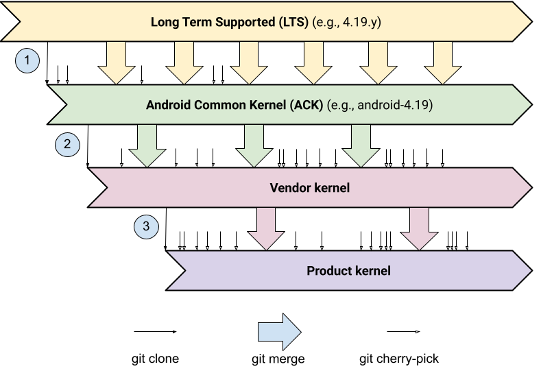
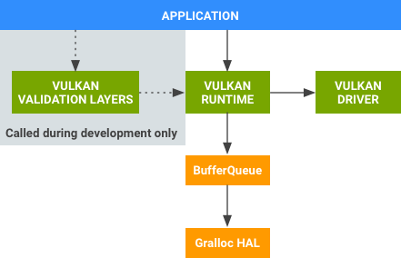

[leland.zip](https://leland.zip/)

## Pixel 8


- [Setup Environment](https://leland.zip/pixel8.html#setup-environment)
  - [Setup (rootless) Phone](https://leland.zip/pixel8.html#setup-rootless-phone)
  - [Setup Host](https://leland.zip/pixel8.html#setup-host)
- [Setup Host](https://leland.zip/pixel8.html#setup-host)
- [WorkFlow](https://leland.zip/pixel8.html#workflow)
- [Kernel](https://leland.zip/pixel8.html#kernel)
  - [Generic Kernel Image (GKI)](https://leland.zip/pixel8.html#generic-kernel-image-gki)
  - [Building Pixel Kernel](https://leland.zip/pixel8.html#building-pixel-kernels)
- [GPU](https://leland.zip/pixel8.html#gpu)
  - [Vulkan](https://leland.zip/pixel8.html#vulkan)

## Setup Environment

[The Rising Sea](https://ncatlab.org/nlab/show/The+Rising+Sea) A hard nut may be cracked not immediately by sheer punctual force, but eventually by gently immersing it into a whole body of water.

George Hotz: You gotta spend time to setup your environment nice because once your environment is nice everything else is nice. 

### Setup (rootless) Phone

#### Enable Developer Options
- Settings
- About phone
- Click Build number until Developer Options are enabled
- In settings search for and enable "USB debugging"
#### Install Termux
 - It is highly recommended to not install Termux apps from Play Store
 - Download the latest https://github.com/termux/termux-app/releases
 - Move the apk to a flash drive then open the apk to install
 - In Termux: passwd (to set a password for your user)
 - In Termux: pkg update && pkg install openssh nmap clang vim gdb binutils-is-llvm && ssh-keygen -A
 - Create a password, in Termux: passwd

### Setup Host
- Download adb: https://developer.android.com/tools/releases/platform-tools#downloads
- Download ssh

### WorkFlow
 Currently I'm ssh'ing into Termux over USB to interact with the phone. Here's how to do that. 

#### On Phone
- Start ssh: sshd
- Confirm ssh is running (usually port 8022): nmap localhost

#### On Host
- adb forward tcp:8022 tcp:8022
- ssh localhost -p 8022
- To copy a file from the phone to the host: ```scp u0_a265@192.168.1.121:/system/lib64/libvulkan.so .```

#### Debug Host
- If the following is seen:
    ```
    harvest@binja-box:~$ adb devices
    List of devices attached 59253ADYT113RN no permissions (user in plugdev group; are your udev rules wrong?); see [http://developer.android.com/tools/device.html]
    ```
    
    Run lsusb and record the ID of the pixel:
  
    ```
    Bus 001 Device 007: ID 18d1:4ee7 Google Inc. Nexus/Pixel Device (charging + debug)
    Then create /etc/udev/rules.d/51-android.rules with contents:
    SUBSYSTEM=="usb", ATTR{idVendor}=="18d1", ATTR{idProduct}=="4ee7", MODE="0666", GROUP="plugdev"
    ```
    
    Then create /etc/udev/rules.d/51-android.rules with contents

    ```
    SUBSYSTEM=="usb", ATTR{idVendor}=="18d1", ATTR{idProduct}=="4ee7", MODE="0666", GROUP="plugdev"
    ```

    Finally restart adb: ```adb kill-server && adb start-server```
  
- If the following is seen:
    ```
    harvest@binja-box:~$ adb devices
    List of devices attached
    59253ADYT113RN unauthorized
    ```
    Allow usb debugging on the phone. 

### Kernel

 The Pixel 8 has a codeword of shiba and the Pixel 8 Pro has a codeword of husky. Combining these codewords produces shusky. 

 
- Binary path in AOSP tree: [device/google/shusky-kernel](https://android.googlesource.com/device/google/shusky-kernel/)
- Repository branch: [android-gs-shusky-5.15-android14-d1](https://android.googlesource.com/kernel/google-modules/soc/gs/+/refs/heads/android-gs-shusky-5.15-android14-d1)
- Clone and branch into shusky:
  - git clone https://android.googlesource.com/kernel/google-modules/soc/gs
  - cd gs
  - git checkout android-gs-shusky-5.15-android14-d1

#### Generic Kernel Image (GKI)

 Link to GKI doc: [Android GKI](https://source.android.com/docs/core/architecture/kernel/generic-kernel-image)
 
 


#### Building Pixel Kernels
 
 This [link](https://source.android.com/docs/setup/build/building-pixel-kernels) provides step-by-step instructions on how to download, compile, and flash a custom Pixel kernel for development

### GPU
 
 The Pixel 8 uses Immortalis-G715

- Documentation: [developer arm docs](https://developer.arm.com/Processors/Immortalis-G715#Technical-Specifications)
- GPU device: ```/dev/mali0``` with permission 666
- Files that directly reference /dev/mali0 from vendor image:
  - vendor/google_devices/shiba/proprietary/lib64/libgpudataproducer.so
  - vendor/google_devices/shiba/proprietary/apex/com.google.pixel.camera.hal.apex
  - vendor/google_devices/shiba/proprietary/lib64/libmemtrack-pixel.so
  - vendor/google_devices/shiba/proprietary/lib64/lib_aion_buffer.so
- Acquire a driver binary blob:
  - Download the corresponding vendor [image](https://developers.google.com/android/drivers#shiba)
  - Extract and execute ```extract-google_devices-shiba.sh```
  - cd vendor/google_devices/shiba/proprietary
  - 7z x vendor.img
  - The gpu driver binary blob is at:
    ```vendor/google_devices/shiba/proprietary/firmware/mali_csffw.bin```


- Other files of **GPU** interest from vendor image:
  - lib64/hw/vulkan.mali.so
  - lib64/libOpenCL.so
  - lib64/egl/libGLES_mali.so
  - lib64/arm.mali.platform-V1-ndk.so
  - lib64/libbw_av1enc.so
  - lib64/libgc2_bw_av1_enc.so
  - lib64/libvendorgraphicbuffer.so
  - lib64/hw/android.hardware.graphics.allocator-aidl-impl.so
  - lib64/hw/android.hardware.graphics.mapper@4.0-impl.so
 
#### Vulkan

- [Home page](https://www.vulkan.org/)
- [Documentation](https://docs.vulkan.org/spec/latest/chapters/introduction.html)
- [Code Samples](https://github.com/KhronosGroup/Vulkan-Samples)

 

| Component name           | Provider             | Description                                                                                                                                                                                                                                                                                                                                                              |
|--------------------------|----------------------|--------------------------------------------------------------------------------------------------------------------------------------------------------------------------------------------------------------------------------------------------------------------------------------------------------------------------------------------------------------------------|
| Vulkan Validation Layers | Android (in the NDK) | Libraries used during the development of Vulkan apps to find errors in an app's use of the Vulkan API. After API usage errors are found, these libraries should be removed.                                                                                                                                                                                              |
| Vulkan Runtime           | Android              | A native library, ```/system/lib64/libvulkan.so```, that provides a native Vulkan API. Most of Vulkan Runtime's functionality is implemented by a driver  provided by the GPU vendor. Vulkan Runtime wraps the driver, provides API  interception capabilities (for debugging and other developer tools), and  manages the interaction between the driver and the platform  dependencies. |
| Vulkan Driver            | SoC                  | Located: ```lib64/hw/vulkan.mali.so``` on the Pixel 8. Maps the Vulkan API onto hardware-specific GPU commands and interactions with the kernel graphics driver.                                                                                                                                                                                                                                                                |
