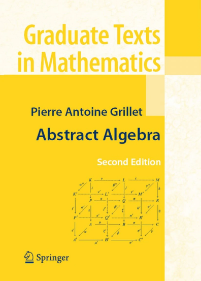

[leland.zip](https://leland.zip/)

## Reading List

A collection of useful literature

### Math
- Software Foundations: https://softwarefoundations.cis.upenn.edu/
- Category Theory: https://www.andrew.cmu.edu/user/jonasf/80-413-713/
- nLab: https://ncatlab.org/nlab/all_pages
- Harvest and Sowing: https://tongchow.github.io/ReSI.pdf

### RE and Program Analysis
- Qualys Blog: https://blog.qualys.com/vulnerabilities-threat-research
- OALabs Blog: https://research.openanalysis.net
- DAY[0] Youtube channel: https://www.youtube.com/@dayzerosec
- Binja Blog: https://binary.ninja/blog
- LaurieWired: https://lauriewired.com
- Mobius Strip: https://www.msreverseengineering.com/blog
- Principles of Abstract Interpretation: https://mitpress.mit.edu/9780262044905/principles-of-abstract-interpretation

### Documentation
- Binja Doc: https://docs.binary.ninja/dev/index.html
- Linux: https://github.com/torvalds/linux/blob/master/Documentation/index.rst
- Andoird bionic: https://android.googlesource.com/platform/bionic/
- Corkami: https://github.com/corkami/pics/tree/master/binary

### Videos
- DIFUZE: Android Kernel Driver Fuzzing: https://www.youtube.com/watch?v=XFDHzSLGx7o&t=1s
