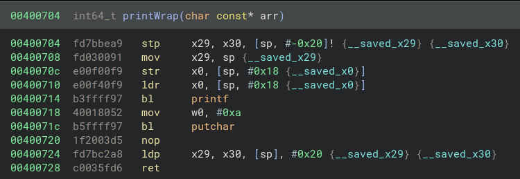
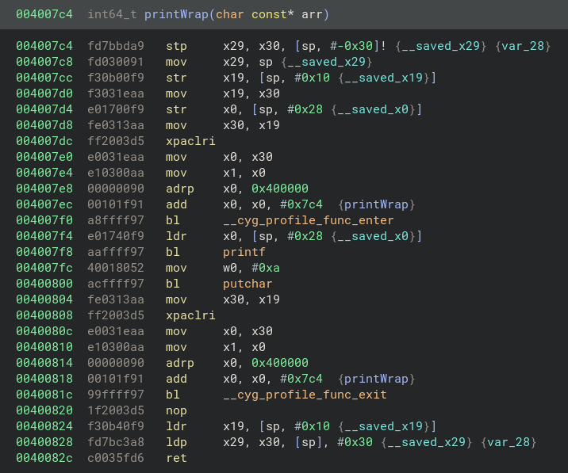

[leland.zip](https://leland.zip/)

## Snippets


- [Tracing a program](https://leland.zip/snippets.html#trace-program)

## Trace Program

The gcc flag ```-finstrument-functions``` instruments a binary with two functions:
- Call to ```__cyg_profile_func_enter``` after every compiled function prologue
- Call to ```__cyg_profile_func_exit``` before every compiled function epilogue

for linux targets.

The below images show the same local function without and with ```-finstrument-functions``` in arm64:

### Local arm64 function without -finstrument-functions


### Local arm64 function with -finstrument-functions



### Hook

The instrumented calls can be hooked for the purposes of reverse engineering, vuln research and performance profiling.

```
#include  <stdio.h>

void __cyg_profile_func_enter(void *funcAddr, void *callSite) {
  printf("ENTER: %p, from %p\n", funcAddr, callSite);
}

void __cyg_profile_func_exit(void *funcAddr, void *callSite) {
  printf("EXIT: %p, from %p\n", funcAddr, callSite);
}
```

Can be compiled: ```gcc -shared -g hook.c -o hook.so```

### Compile program of interest

```gcc -fno-pie -no-pie -g -finstrument-functions main.c -o main```

### LD_PRELOAD
``` LD_PRELOAD=/home/leland/function_instrumentation/hook.so ./main``` 
